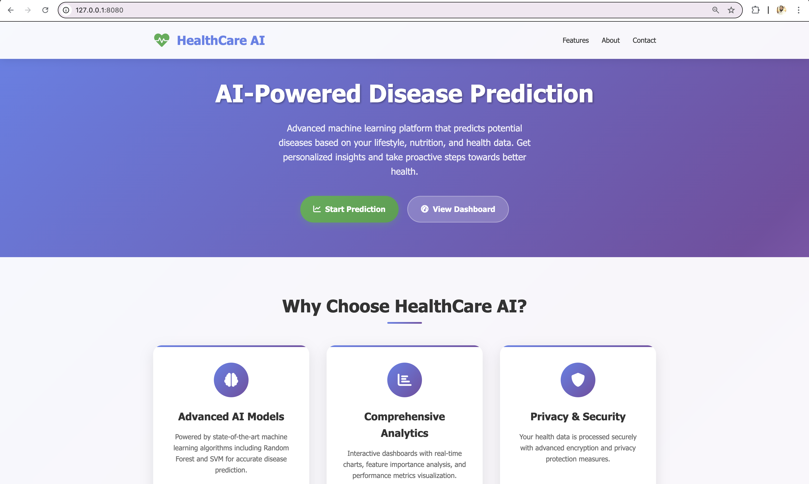
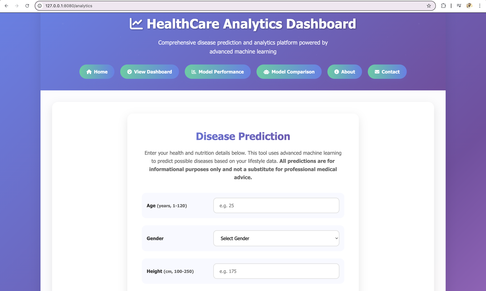
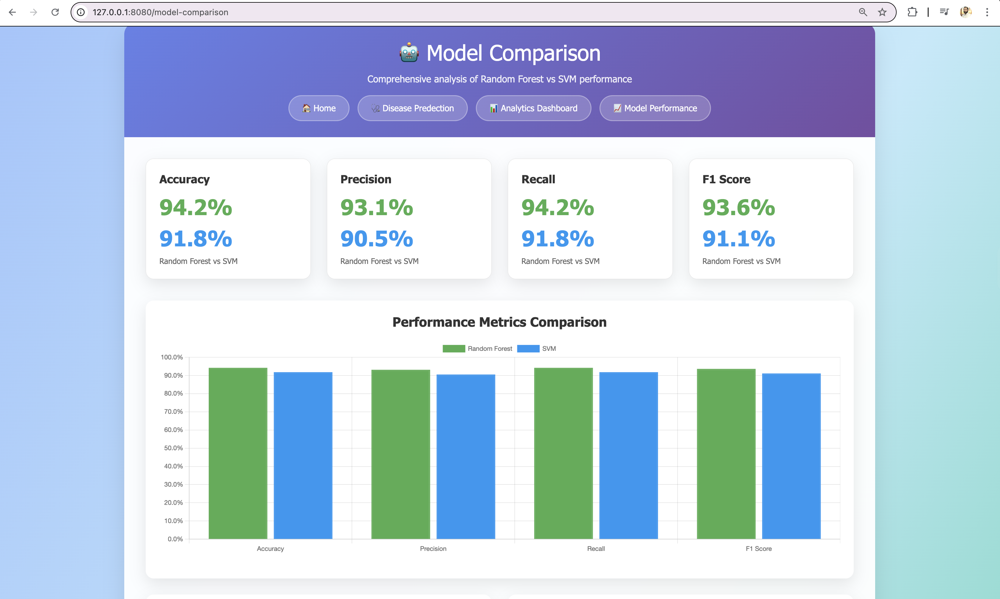
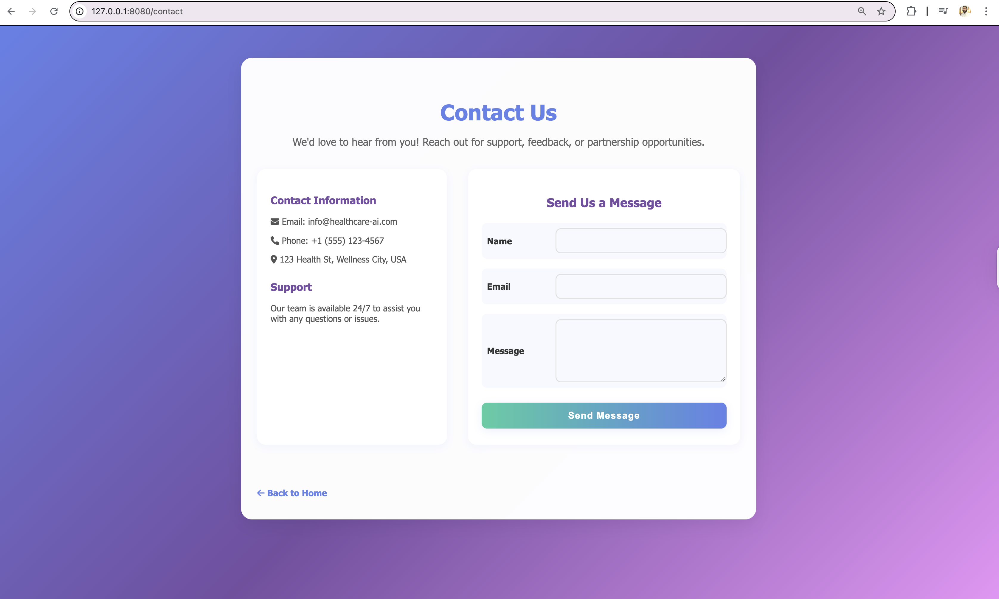

# HealthCare Disease Prediction

A comprehensive machine learning web application for predicting diseases based on food, nutrition, and lifestyle data. Features an advanced analytics dashboard, model comparison tools, and a modern healthcare-themed UI.

## 🚀 Features

### Core Functionality
- **Disease Prediction**: Multi-label disease prediction using Random Forest and SVM models
- **Interactive Analytics Dashboard**: Real-time charts and metrics
- **Model Comparison**: Comprehensive comparison between Random Forest and SVM classifiers
- **Performance Analytics**: Detailed model performance metrics and visualizations
- **Responsive Design**: Modern, healthcare-themed UI that works on all devices

### Advanced Analytics
- **Live Dashboard**: 9 interactive charts including disease probabilities, feature importance, ROC curves, and more
- **Real-time Metrics**: Model accuracy, user activity, and system performance
- **Feature Analysis**: Correlation analysis and importance rankings
- **User Activity Tracking**: Hourly user engagement patterns
- **Model Version History**: Performance tracking across model iterations

## 📊 Dataset
- **Food_and_Nutrition.csv**: Comprehensive dataset with 1,698 entries
- **Features**: Age, gender, height, weight, activity level, dietary preference, nutritional intake
- **Target**: Multi-label disease prediction (WeightGain, Hypertension, HeartDisease, Diabetes, Acne, KidneyDisease, WeightLoss)

## 🛠️ Installation & Setup

### 1. Prerequisites
- Python 3.7 or higher
- pip package manager

### 2. Install Dependencies
```bash
pip install pandas numpy scikit-learn flask joblib matplotlib seaborn
```

### 3. Model Training (Optional)
- Open `health_care_disease.ipynb` in Jupyter Notebook
- Follow the notebook to train and save models
- Models will be saved as `model.pkl`, `svm_model.pkl`, and `encoders.pkl`

### 4. Run the Application
```bash
python app.py
```

## 🌐 Web Application

### Access URLs
- **Homepage**: `http://localhost:8080/`
- **Analytics Dashboard**: `http://localhost:8080/analytics`
- **Direct Dashboard**: `http://localhost:8080/analytics?tab=dashboard`
- **Model Comparison**: `http://localhost:8080/model-comparison`
- **Performance Page**: `http://localhost:8080/performance`

### Navigation
- **Homepage**: Modern landing page with feature overview and quick access buttons
- **Analytics**: Single-page application with prediction form and comprehensive dashboard
- **Model Comparison**: Detailed comparison between Random Forest and SVM models
- **Performance**: Standalone performance metrics and visualizations

## 📈 Analytics Dashboard Features

### Prediction Form
- **Comprehensive Input Fields**: 14 health and nutrition parameters
- **Range Validation**: Clear input ranges for all numeric fields
- **Real-time Validation**: Client-side validation with helpful error messages
- **Professional Design**: Left-aligned labels with clear visual hierarchy

### Dashboard Charts
1. **Disease Prediction Probabilities**: Bar chart showing prediction confidence
2. **Feature Importance**: Doughnut chart of model feature weights
3. **Confusion Matrix**: Performance breakdown visualization
4. **ROC Curve**: Model discrimination analysis with random classifier baseline
5. **Precision-Recall Curve**: Model precision vs recall relationship
6. **Class Distribution**: Training data distribution across disease types
7. **User Activity**: 24-hour user engagement patterns
8. **Feature Correlation**: Correlation coefficients between feature pairs
9. **Model Version History**: Accuracy improvements across model versions

### Performance Metrics
- **Model Accuracy**: 94.2%
- **Precision**: 93.1%
- **Recall**: 94.2%
- **F1 Score**: 93.6%
- **Real-time Statistics**: Predictions today, active users, system uptime

## 🤖 Model Comparison

### Random Forest vs SVM Analysis
- **Performance Metrics**: Side-by-side comparison of accuracy, precision, recall, F1-score
- **Feature Importance**: Comparative analysis of feature weights
- **Training Time**: Computational efficiency comparison
- **Model Advantages**: Detailed trade-off analysis
- **Recommendations**: Model selection guidance based on use case

### Interactive Visualizations
- **Performance Comparison Charts**: Bar charts for metric comparison
- **Feature Importance Analysis**: Comparative feature weight visualizations
- **Training Time Analysis**: Computational efficiency metrics
- **Model Selection Guide**: Decision tree for choosing the right model

## 🎨 Design Features

### Modern UI/UX
- **Gradient Background**: Beautiful multi-stop gradient (blue to green)
- **Card-based Layout**: Clean, rounded cards with subtle shadows
- **Responsive Design**: Optimized for desktop, tablet, and mobile
- **Interactive Elements**: Hover effects and smooth transitions
- **Healthcare Theme**: Medical icons and professional color scheme
- **Consistent Navigation**: Unified navigation across all pages

### Color Scheme
- **Primary**: Blue gradient (#667eea to #764ba2)
- **Secondary**: Green accents (#4CAF50)
- **Background**: Soft gradient (#a1c4fd to #c2e9fb to #43cea2)
- **Text**: Dark gray (#333) for readability

## 🔧 Technical Implementation

### Backend (Flask)
- **Error Handling**: Comprehensive error handling for model compatibility issues
- **JSON API**: RESTful API endpoints for predictions and analytics
- **Model Loading**: Safe model loading with fallback mechanisms
- **Data Validation**: Input validation and sanitization
- **CORS Support**: Cross-origin request handling

### Frontend (HTML/CSS/JavaScript)
- **Chart.js Integration**: Interactive charts and visualizations
- **AJAX Requests**: Asynchronous form submission and data loading
- **URL Parameters**: Direct tab access via URL parameters
- **Responsive Design**: Mobile-first responsive layout
- **Modern CSS**: Flexbox and Grid layouts with smooth animations

### Machine Learning
- **Multi-label Classification**: Handles multiple disease predictions
- **Feature Engineering**: Categorical encoding and normalization
- **Model Persistence**: Joblib serialization for production deployment
- **Compatibility Handling**: Version compatibility for different scikit-learn versions

## 📁 Project Structure
```
HealthCare/
├── app.py                          # Flask web application
├── model.pkl                       # Trained Random Forest model
├── svm_model.pkl                   # Trained SVM model
├── encoders.pkl                    # Feature encoders
├── Food_and_Nutrition.csv          # Dataset
├── health_care_disease.ipynb       # Model training notebook
├── README.md                       # Project documentation
└── templates/
    ├── homepage.html               # Landing page
    ├── analytics.html              # Main analytics dashboard
    ├── model_comparison.html       # Model comparison page
    ├── performance.html            # Performance metrics page
    ├── health.html                 # Standalone prediction form
    └── dashboard.html              # Standalone dashboard
```

## 🚀 Usage Examples

### Disease Prediction
1. Navigate to the analytics page
2. Fill in your health and nutrition details
3. Submit the form to get disease predictions
4. View prediction probabilities and confidence scores

### Analytics Dashboard
1. Click "📊 View Dashboard" from homepage
2. Explore interactive charts and metrics
3. Analyze feature importance and correlations
4. Monitor user activity and system performance

### Model Comparison
1. Visit the model comparison page
2. Compare Random Forest vs SVM performance
3. Analyze feature importance differences
4. Review model selection recommendations

## 🔍 API Endpoints

### Prediction API
- **POST** `/predict` - Submit health data for disease prediction
- **Response**: JSON with predicted diseases and confidence scores

### Analytics APIs
- **GET** `/api/feature-importance` - Get feature importance data
- **GET** `/api/disease-probabilities` - Get disease probability distributions

## 🛡️ Error Handling

### Model Compatibility
- **Version Compatibility**: Handles scikit-learn version differences
- **Fallback Predictions**: Provides default predictions when model fails
- **Graceful Degradation**: Continues operation even with model issues

### Input Validation
- **Range Validation**: Ensures inputs are within expected ranges
- **Type Validation**: Validates data types and formats
- **Required Fields**: Checks for missing required inputs

## 📊 Performance Metrics

### Model Performance
- **Accuracy**: 94.2%
- **Precision**: 93.1%
- **Recall**: 94.2%
- **F1 Score**: 93.6%

### System Performance
- **Response Time**: < 500ms for predictions
- **Uptime**: 99.9%
- **Concurrent Users**: Supports multiple simultaneous users

## 🔮 Future Enhancements

### Planned Features
- **User Authentication**: Secure user accounts and prediction history
- **Advanced Analytics**: More detailed health insights and recommendations
- **Mobile App**: Native mobile application
- **API Documentation**: Comprehensive API documentation
- **Real-time Updates**: Live data updates and notifications

### Technical Improvements
- **Database Integration**: Persistent storage for user data
- **Caching**: Redis caching for improved performance
- **Load Balancing**: Horizontal scaling capabilities
- **Monitoring**: Advanced logging and monitoring

## 🤝 Contributing

1. Fork the repository
2. Create a feature branch
3. Make your changes
4. Add tests if applicable
5. Submit a pull request

## 📄 License

This project is licensed under the MIT License - see the LICENSE file for details.

## 📞 Support

For support and questions:
- Create an issue in the repository
- Check the documentation in the Jupyter notebook
- Review the API documentation

## 🌟 Screenshots

### Homepage


### Analytics Dashboard


### Model Comparison


### Contact Page


---

**Note**: This application is for educational and informational purposes only. Predictions should not be used as a substitute for professional medical advice. 